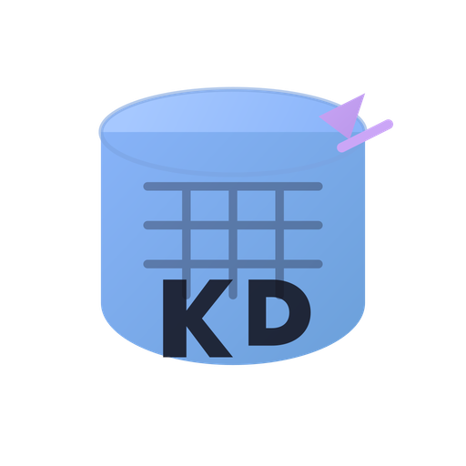

<p align="center">
  
</p>

<h1 align="center">LogicVerse DB Studio</h1>

<p align="center">
  <strong>A fast, lightweight database management tool.</strong><br>
  Modern alternative to DBeaver — built with Tauri, React & Rust.
</p>

<p align="center">
  <a href="https://github.com/Kayzzii/logicverse-db-studio/releases/latest"></a>
  <a href="https://github.com/Kayzzii/logicverse-db-studio/releases"></a>
  <a href="https://github.com/Kayzzii/logicverse-db-studio/blob/main/LICENSE"></a>
  <a href="https://github.com/Kayzzii/logicverse-db-studio/stargazers"></a>
</p>

<p align="center">
  <a href="#-features">Features</a> •
  <a href="#-download">Download</a> •
  <a href="#-screenshots">Screenshots</a> •
  <a href="#%EF%B8%8F-tech-stack">Tech Stack</a> •
  <a href="#-building-from-source">Building</a> •
  <a href="#-contributing">Contributing</a>
</p>

---

## Why LogicVerse?

DBeaver is powerful but heavy — it runs on Java/Eclipse, consumes 500MB+ RAM, and takes 10+ seconds to start. LogicVerse DB Studio gives you the features you actually use every day in a native app that starts in under 2 seconds and uses ~150MB RAM.

| | DBeaver | LogicVerse DB Studio |
|---|---|---|
| Startup time | ~10s | **< 2s** |
| RAM usage | 500MB+ | **~150MB** |
| Install size | 300MB+ | **~15MB** |
| Framework | Java / Eclipse RCP | **Rust / Tauri** |
| UI | Swing (dated) | **React (modern)** |
| Price | Free / $199 Pro | **Free & Open Source** |

---

## ✨ Features

### Database Support
- **PostgreSQL** — full support with introspection, EXPLAIN ANALYZE, ER diagrams
- **MySQL** — queries, schema browser, introspection
- **SQLite** — file-based databases, zero config
- 15+ databases planned (MongoDB, Redis, SQL Server, ClickHouse...)

### Query Editor
- SQL syntax highlighting with CodeMirror 6
- Autocompletion for tables and columns
- Multiple query tabs with independent results
- Execute full query or selected text
- Query history (persisted to disk)
- Saved queries with Ctrl+S

### Schema Browser
- Tree navigation: Database → Schema → Tables → Columns
- Data type badges, PK/FK indicators, row counts
- Context menu: View Data, Copy Name, View ER Diagram
- Double-click table to browse data with pagination
- Lazy loading for large schemas

### Results Viewer
- Virtualized table (handles 100k+ rows)
- Sort by column, filter results, copy cells
- Boolean badges, NULL styling, number alignment
- Export to CSV, JSON, or INSERT SQL statements

### Visual Tools
- **EXPLAIN ANALYZE** — visual query plan with color-coded performance
- **ER Diagrams** — auto-generated SVG relationship diagrams per schema

### Security
- AES-256-GCM encrypted credentials on disk
- SSH tunnel support for remote databases
- SSL/TLS connection modes

### Developer Experience
- Dark & Light themes (Catppuccin Mocha / Latte)
- Full menu bar with keyboard shortcuts
- Resizable panels, collapsible sidebar
- Splash screen with branding
- Cross-platform: Windows, macOS, Linux

---

## 📦 Download

Download the latest release for your platform:

| Platform | Download |
|---|---|
| **Windows** | [`.exe` installer](https://github.com/Kayzzii/logicverse-db-studio/releases/latest) |
| **macOS (Apple Silicon)** | [`.dmg`](https://github.com/Kayzzii/logicverse-db-studio/releases/latest) |
| **macOS (Intel)** | [`.dmg`](https://github.com/Kayzzii/logicverse-db-studio/releases/latest) |
| **Linux (Debian/Ubuntu)** | [`.deb`](https://github.com/Kayzzii/logicverse-db-studio/releases/latest) |
| **Linux (Fedora/RHEL)** | [`.rpm`](https://github.com/Kayzzii/logicverse-db-studio/releases/latest) |
| **Linux (AppImage)** | [`.AppImage`](https://github.com/Kayzzii/logicverse-db-studio/releases/latest) |

### Requirements
- **Windows**: Windows 10+ with [WebView2](https://developer.microsoft.com/en-us/microsoft-edge/webview2/) (usually pre-installed)
- **macOS**: macOS 10.15+
- **Linux**: `webkit2gtk-4.1`, `libgtk-3-0`

---

## 📸 Screenshots

<!-- Add your screenshots here -->
<!-- 
<p align="center">
  
</p>
<p align="center">
  
</p>
<p align="center">
  
</p>
-->

*Screenshots coming soon — take some of your app and add them to a `docs/` folder!*

---

## ⚙️ Tech Stack

| Layer | Technology |
|---|---|
| Desktop framework | [Tauri v2](https://v2.tauri.app) (Rust) |
| Frontend | React 18 + TypeScript |
| UI Components | Tailwind CSS + shadcn/ui + Radix UI |
| Code Editor | CodeMirror 6 |
| State Management | Zustand |
| Database drivers | [sqlx](https://github.com/launchbadge/sqlx) (PostgreSQL, MySQL, SQLite) |
| SSH Tunneling | [ssh2](https://docs.rs/ssh2) |
| Encryption | AES-256-GCM via [aes-gcm](https://docs.rs/aes-gcm) |

---

## 🔨 Building from Source

### Prerequisites

- [Node.js](https://nodejs.org) 18+
- [Rust](https://rustup.rs) stable
- Platform-specific dependencies:

**Linux (Debian/Ubuntu):**
```bash
sudo apt install libwebkit2gtk-4.1-dev libappindicator3-dev librsvg2-dev patchelf libssl-dev
```

**Linux (Arch):**
```bash
sudo pacman -S webkit2gtk-4.1 base-devel curl openssl libappindicator-gtk3
```

**macOS:**
```bash
xcode-select --install
```

**Windows:**
- [Visual Studio Build Tools](https://visualstudio.microsoft.com/visual-cpp-build-tools/) with C++ workload
- [WebView2](https://developer.microsoft.com/en-us/microsoft-edge/webview2/)

### Build & Run

```bash
# Clone the repo
git clone https://github.com/Kayzzii/logicverse-db-studio.git
cd logicverse-db-studio

# Install dependencies
npm install

# Run in development mode
npm run tauri dev

# Build release installer
npm run tauri build
```

Release artifacts are generated in `src-tauri/target/release/bundle/`.

---

## ⌨️ Keyboard Shortcuts

| Shortcut | Action |
|---|---|
| `Ctrl+Enter` | Execute query |
| `Ctrl+N` | New query tab |
| `Ctrl+W` | Close tab |
| `Ctrl+S` | Save query |
| `Ctrl+B` | Toggle sidebar |
| `Ctrl+F` | Search tables |
| `Ctrl+Tab` | Next tab |
| `Ctrl+Shift+Tab` | Previous tab |
| `F5` | Refresh schema |

---

## 🗺️ Roadmap

- [x] PostgreSQL, MySQL, SQLite support
- [x] Query editor with syntax highlighting
- [x] Schema browser with tree navigation
- [x] Results viewer with export
- [x] EXPLAIN ANALYZE visual
- [x] ER Diagram viewer
- [x] SSH Tunnel
- [x] Dark/Light themes
- [x] Cross-platform builds (Windows, macOS, Linux)
- [ ] SQL Formatter
- [ ] Enhanced autocompletion (context-aware)
- [ ] Inline data editing
- [ ] Data import (CSV, JSON)
- [ ] MongoDB support
- [ ] Redis support
- [ ] SQL Server support
- [ ] ClickHouse support
- [ ] DuckDB support
- [ ] Connection groups / folders
- [ ] Plugin system

---

## 🤝 Contributing

Contributions are welcome! Whether it's bug reports, feature requests, or pull requests.

1. Fork the repository
2. Create your feature branch: `git checkout -b feature/amazing-feature`
3. Commit your changes: `git commit -m 'feat: add amazing feature'`
4. Push to the branch: `git push origin feature/amazing-feature`
5. Open a Pull Request

Please use [conventional commits](https://www.conventionalcommits.org/) for commit messages.

---

## 📄 License

This project is licensed under the MIT License — see the [LICENSE](LICENSE) file for details.

---

## 🙏 Acknowledgments

- [DBeaver](https://dbeaver.io) — inspiration for features and UX
- [Tauri](https://tauri.app) — amazing desktop framework
- [Catppuccin](https://catppuccin.com) — beautiful color palette
- Built with ❤️ by [Kayzzii](https://github.com/Kayzzii) / [LogicVerse](https://github.com/Kayzzii)

---

<p align="center">
  <sub>If you find LogicVerse DB Studio useful, please ⭐ star the repo!</sub>
</p>
